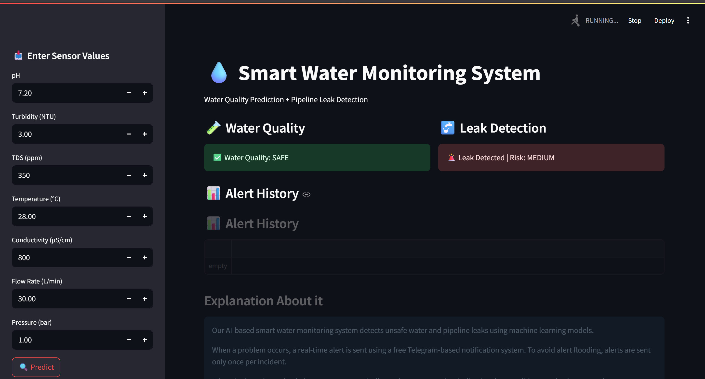
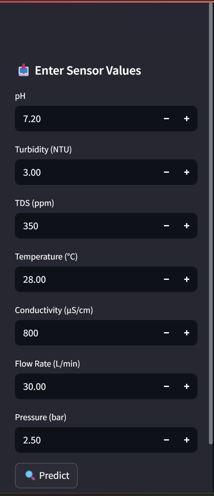
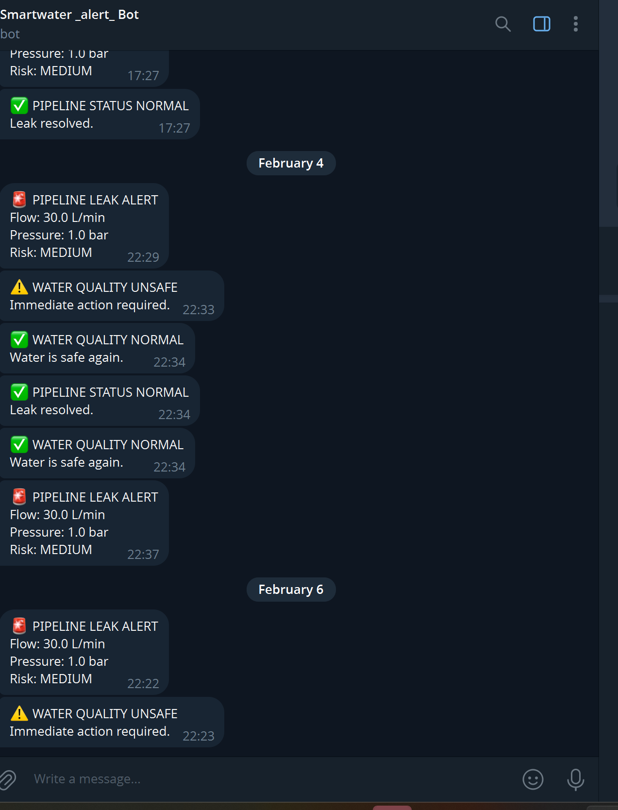

💧 MOLEDET-AI

🚀 AI-Based Smart Water Monitoring & Leak Detection System

🌍 About the Project:

MOLEDET is an AI-powered smart water monitoring system that detects pipeline leaks and monitors water quality using sensor data and machine learning.

It provides real-time alerts, reduces water wastage, and ensures safe water supply through intelligent monitoring.

⚙️ Features:

🚰 Leak detection using Flow Rate & Pressure

🧪 Water quality prediction (Safe / Unsafe)

⚡ Real-time Telegram alert system

📊 Interactive Streamlit dashboard

🚦 Risk classification (Low / Medium / High)

🔕 Alert spam control using flags

✅ Recovery alerts when system returns to normal

🧠 Tech Stack:

Python
Machine Learning (Random Forest)
Streamlit
Pandas & Scikit-learn
Telegram Bot API

🧪 Sensors Used:

Flow Sensor
Pressure Sensor
pH Sensor
Turbidity Sensor
TDS Sensor
Temperature Sensor
Conductivity Sensor

🧩 System Architecture:

MOLEDET follows a layered intelligent architecture:
🔷 Sensor Layer:

📡 Collects real-time data from pipeline and water
Flow, Pressure, pH, Turbidity, TDS

🔷 Data Processing Layer:

⚡ Cleans and prepares data for analysis

Filtering & formatting
🔷 AI Prediction Layer:

🧠 Random Forest model predicts:
Leak / No Leak
Safe / Unsafe water

🔷 Decision Layer:

🚦 Smart logic applied:
Risk classification
Alert spam control
Recovery detection

🔷 Application Layer:

📊 Streamlit dashboard displays:
Status, predictions, alerts

🔷 Alert System:

📩 Telegram API sends real-time alerts

alerts

🔄 Data Flow:

Sensors → Data Processing → AI Model → Decision Logic → Dashboard + Alerts

📊 Project Demo:

### 📊 Dashboard Overview  

### 🚨 Leak Detection  

✔ System detects abnormal flow and pressure  
✔ Displays risk level (High / Medium)

### 🎛️ Sensor Input Simulation  

✔ User can simulate real sensor values  
✔ Helps in testing different scenarioss

### 📩 Real-Time Alerts  

✔ Instant notification via Telegram  
✔ Alerts for leak and unsafe water  
✔ Includes recovery notification

📈 Future Improvements:

Real-time IoT sensor integration (ESP32)
Cloud deployment
Mobile app development
Advanced anomaly detection
GPS-based leak location detection

👨‍💻 Author:

Mohit Singh Bhadoriya

⭐ Show Your Support:

If you like this project, give it a ⭐ on GitHub!
